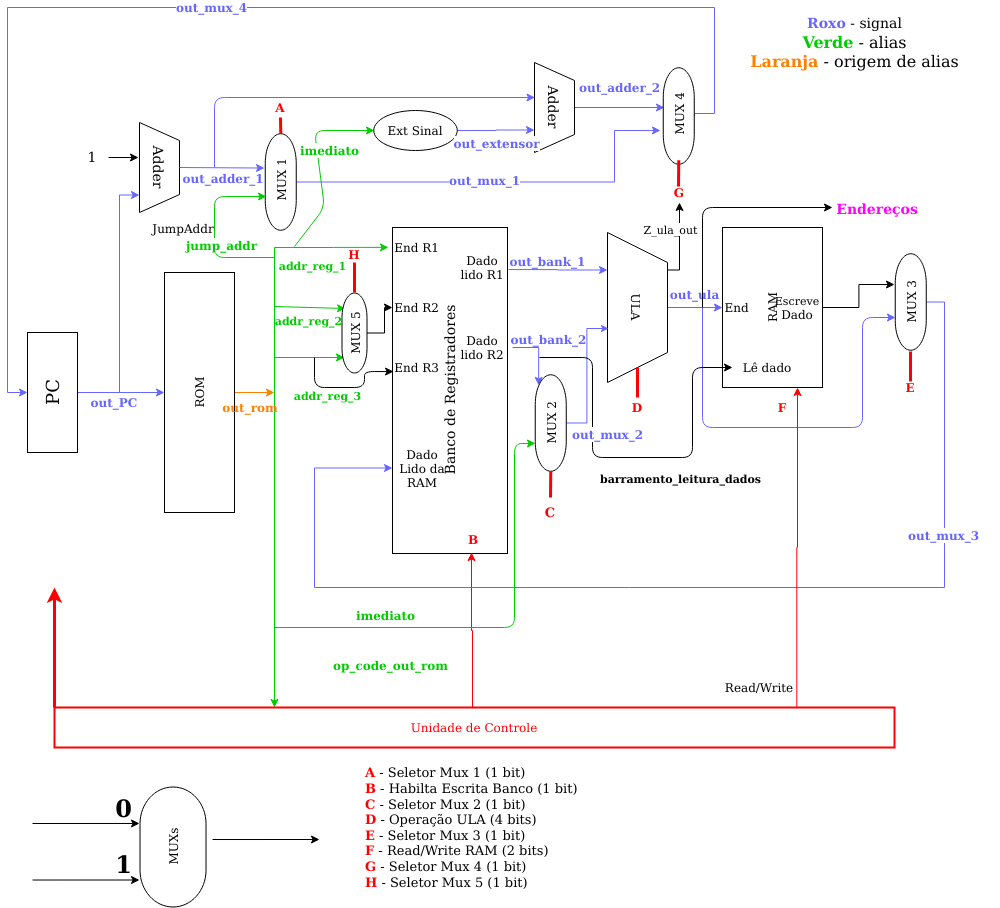

# Calculadora

A arquitetura escolhida foi Registrador-Registrador.

O formato das instruções é o representado abaixo. A instrução tera no total 18 bits. Para o caso das instruções R e J haverão bits da instrução não utilizados:

### Instrução R

| OpCode        | Registrador 3 | Registrador 1 | Registrador 2 | Sem uso       |
| ------------- | ------------- | ------------- | ------------- | ------------- |
| 4 bits        | 3 bits        | 3 bits        | 3 bits        | 5 bits        |

### Instrução I

| OpCode        | Registrador 3 | Registrador 1 | Imediato      |
| ------------- | ------------- | ------------- | ------------- |
| 4 bits        | 3 bits        | 3 bits        | 8 bits        |

### Instrução J

| OpCode        | Jump Address  |
| ------------- | ------------- |
| 4 bits        | 14 bits       |

Abaixo está representada todas as instruções e suas sintaxes:

| Instrução     | Tipo | OpCode        | Semântica     |
| ------------- | ------------- | ------------- | ------------- |
| Add       | R | 0000          | R3 = R1 + R2  |
| Sub       | R | 0001          | R3 = R1 - R2  |
| And       | R | 0110          | R3 = R1 & R2  |
| Or        | R | 0111          | R3 = R1 | R2  |
| Xor       | R | 1001          | R3 = R1 xor R2|
| Not       | R | 1000          | R3 = ! R1     |
| Jump      | J | 0010          | PC = jumpAddr                                         |
| Load      | I | 0100          | R3 (dest) = M[Imm + R1]                                           |
| Store     | I | 0101          | M[R1+Imm] = R3 (fonte)                                          |
| Beq       | I | 0011          | if R3 = R1: {PC = PC + 1 + branchAddr} else: {PC = PC + 1}|

O funcionamento do decodificador de endereço e os seus respectivos mapas de memória podem ser vistos abaixo:

- endereco possuí 8 bits;

| endereco (7 downto 6)        | paginacao  | Habilita o bloco | Bloco de bits |
| ------------- | ------------- |------------- | ------------- |
| 00            | 0001          | RAM | 0 ~ 63 |
| 01            | 0010          | RAM | 64 ~ 127 |
| 10            | 0100          | IO inputs | 128 ~ 191 |
| 11            | 1000          | IO outpus | 192 ~ 255 |

### IO INPUT 

| Perifério     | enderecamento |
| ------------- | ------------- |
| chave_0_7 | 130 |
| chave_8_15 | 131 |
| chave_16_17 | 132 |
| but_0_prox_input | 135 |
| but_1_enter | 136 |
| but_2 | 137 |
| but_3 | 138 |

### IO OUTPUT

| Perifério     | enderecamento |
| ------------- | ------------- |
| LED_R_0_7 | 200 |
| LED_R_8_15 | 201 |
| LED_G_0_7 | 202 |
| sete_segmentos_0 | 205 |
| sete_segmentos_1 | 206 |
| sete_segmentos_2 | 207 |
| sete_segmentos_3 | 208 |

 
O fluxo de dados principal pode ser observado abaixo:

### Palavra de controle 

| Bit | 11         | 10        | 9                 | 8         | 4 - 7   | 3         | 2        |        1 |          0 |
| -------------| ---------- |---------- |------------------ |---------- |-------- |---------- |--------- |--------- |----------- | 
| Ponto de controle | sel _mux_ 5| sel_mux_1 | hab_escrita_banco | sel_mux_2 | sel_ula | sel_mux_3 | read_ram | wrie_ram | sel_mux_4  |
| Legenda do fluxo | H          |    A      |          B        |  C        | D       | E         |    F(1)  |   F(0)   | G          |

